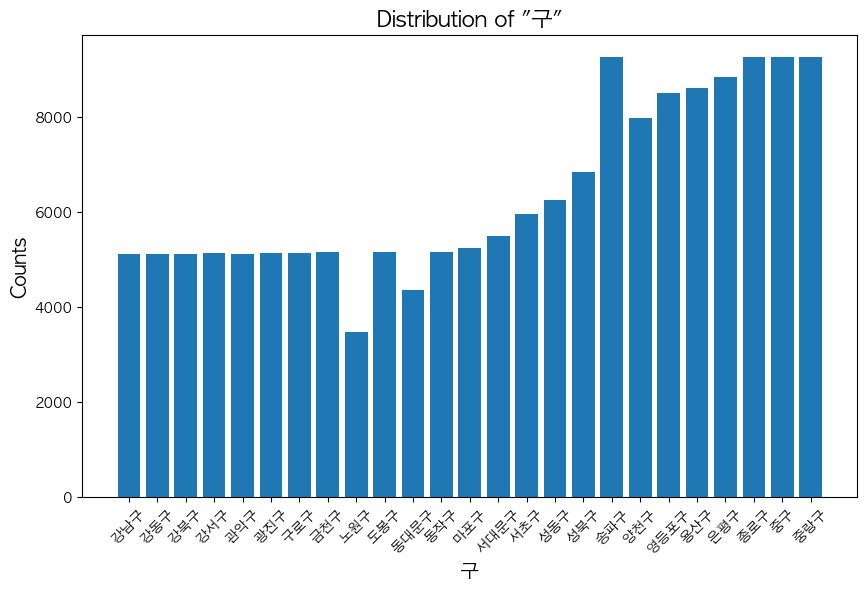
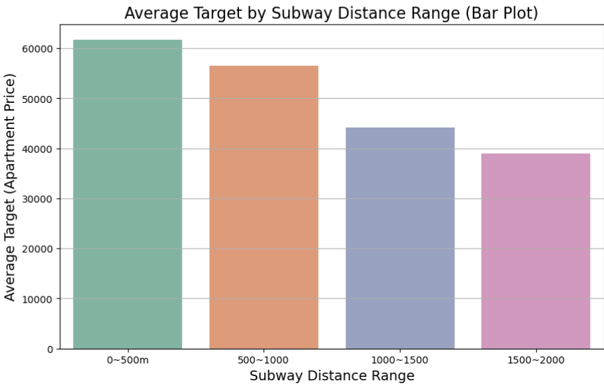
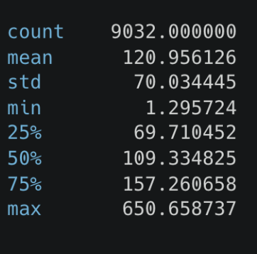
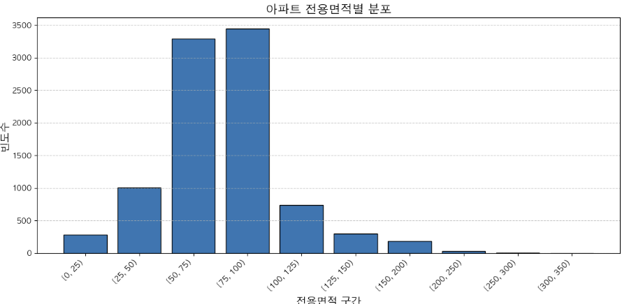
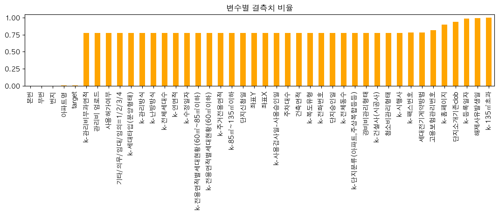
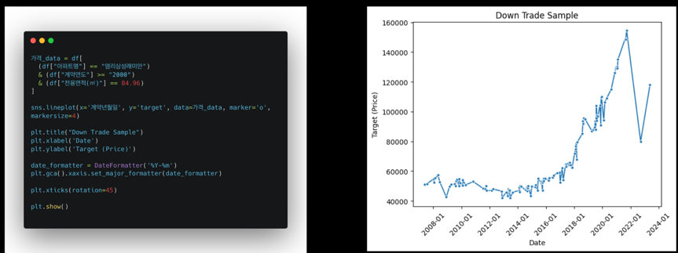

# 서울특별시 아파트 가격 모델 경진대회

# 프로젝트 구성
- `asset` : 이미지 파일
- `distribution_collect` : 외부 데이터 수집 코드
- `model` : 모델링 코드
- `module` : 사용자 정의 모듈
  - `api.py` : 외부 API 모듈
  - `file_load.py` : 데이터 로드 모듈
  - `preprocessing.py` : 전처리 모듈
  - `model.py` : 모델링 모듈
  - `save.py` : 데이터 버전 관리 모듈
- `README.md` : 프로젝트 설명 파일

# 대회 성적

대회 최종 성적은 크게 만족스럽지 못했습니다.  
하지만, 대회가 끝난 뒤 Validate Data를 따로 분리해서 개인적으로 대회를 진행하면서 성능을 개선할 수 있었습니다.


# 프로젝트 전반에 대한 회고
이번 대회는 데이터 전처리부터 모델링, 하이퍼파라미터 튜닝까지 다양한 과정에서 많은 것을 배울 수 있었던 소중한 경험이었습니다. 프로젝트 초기에는 데이터의 특성과 구조를 이해하는 데 초점을 맞췄고, 가설을 수립하며 분석 방향을 정리했습니다. 특히 좌표 정보 결측치를 보완하기 위해 카카오 API를 활용한 점은 데이터의 품질을 높이는 데 중요한 역할을 했습니다.

# 주요 성과
## EDA 및 데이터 전처리

데이터셋의 결측치를 면밀히 분석하고, 좌표 결측치를 보완하여 지역별 가격 패턴을 명확히 파악했습니다.  
아파트 면적, 층수, 지하철 거리와 같은 주요 feature들이 target 값에 미치는 영향을 시각적으로 확인했습니다.

## 모델링 및 성능 개선

베이스라인 모델로 랜덤 포레스트를 사용하여 초기 성능을 파악하고, 이후 LightGBM을 활용해 성능을 최적화했습니다.  
Optuna를 통해 하이퍼파라미터 튜닝을 수행하여 RMSE를 크게 개선했습니다.

## 가설 검증 및 피처 엔지니어링

전용면적 이상치 제거 여부에 따른 RMSE 변화와 Error Score 분석을 통해 이상치 제거의 한계를 확인했습니다.  
한강 거리, 금리 변화 등 파생 변수를 추가하며 모델 성능 개선을 시도했습니다.  

최종 성능: 

> 최종 `RMSE`는 `45000 => 22,055`로, 초기 베이스라인 대비 큰 성능 향상을 이루었습니다.    
> 최종 `RMSE: 22,055`는 `2023-03~06` 자체적인 테스트 데이터셋을 기준으로 측정한 결과입니다.  

## 주요 이슈 및 해결 과정
로컬 Score와 제출 Score의 차이

대회 기간 동안 로컬 Score와 제출 Score 간 큰 차이를 발견했습니다.
Train과 Test 데이터셋의 기간 차이를 고려하지 못한 점이 주요 원인이었으며, 대회 종료 후 강사님의 리뷰를 통해 이 점을 명확히 파악했습니다.

## 결측치 처리의 한계

좌표X, 좌표Y의 결측치를 카카오 API로 보완했으나, 모든 결측치를 완벽히 해결하지 못해 일부 데이터는 분석에서 제외되었습니다.
이상치 제거의 효과

전용면적 이상치를 제거한 모델이 예상과 달리 성능이 저하되는 결과를 보여, 데이터의 다양한 특성을 포괄하는 접근이 중요함을 깨달았습니다.

# 제공되는 데이터셋
- `train.csv`
- `test.csv`
    -  `train` 데이터셋에서 `target` feature만 제거된 상태

# 컬럼

기본 컬럼
```
'시군구', '번지', ...'좌표X', '좌표Y', '단지신청일', 'target'
```

# 데이터셋 크기

```
df = module.file_load.load_origin_train()
df_test = module.file_load.load_origin_test()

df.shape, df_test.shape
```
> train.csv : (1118822, 52)
> test.csv : (9272, 51)

# 데이터 셋 EDA

```python
df_test['계약년월'].value_counts()

# 계약년월
# 202308    3864
# 202307    3695
# 202309    1713
```

테스트 데이터는 2023년 8월 ~ 9월로 분포

## 구별 테스트 데이터 분포

- 데이터가 모든 구에 고르게 분포하지 않지만, 분석에 큰 영향을 주지 않음.




## 평수 가격분포

- 평수가 증가하면 가격이 상승하는 경향성을 보인다.


## 층 과 평수 별 target 분포

10층 이하 고평수일경우 높은 가격 분포를 이루는 아파트가 존재한다


## 층 과 target 관계 

- 고층으로 갈수록 가격이 상승하는 경향이 있으며, 이는 뷰와 프리미엄 아파트에 따른 가치 상승으로 해석될 수 있습니다.

- 낮은 층수일수록 상대적으로 낮은 중앙값을 가지지만, 
이상치가 많이 분포하는 특징을 보입니다. 
나타나는 원인을 심층 분석하기 위해 거래 시점, 위치, 면적, 특수한 입지 , 외부 요인 등을 추가로 분석할 필요가 있어보입니다.


## 좌표 - target

좌표X, 좌표Y 결측치비율 : 77%

특정 지역에 가격이 집중되는 경향이 있으며, 이를 통해 지역별 가격 패턴을 분석할 수 있습니다. 좌표 데이터의 결측치 비율은 77%로, 이를 보완하면 분석 정확도를 높일 수 있을것으로 판단됩니다.


좌표 지점별분석으로 지역별로 아파트 가격이 다르다는것을 알 수 있다.

## 지하철 거리 관계

지하철과의 근접성이 높은 아파트일수록 평균 가격이 높음. 
0-500m 거리 범위의 아파트가 가장 높은 평균 가격을 기록했습니다.   
대중교통 접근성이 아파트 가격에 긍정적인 영향을 미친다는 것을 보여줍니다.  
거리가 멀어질수록 평균 가격 감소. 
500m이내 거리 범위는 두 번째로 높은 평균 가격을 보였으며,   
1~1.5km와 1.5~2.0km 범위로 갈수록 가격이 점차 감소하는 경향을 보였습니다.  
지하철 접근성의 중요성. 
지하철역으로부터의 거리가 짧을수록 입지 조건이 우수하게 평가되어, 해당 지역의 아파트 수요와 가격이 상승하는 효과가 나타난 것으로 보입니다.  




## 버스정류장 거리

버스 정류장과의 거리는 대부분 큰 편차 없이 가까운 분포를 보여,
분류에 활용하기에는 적합하지 않을 것으로 보입니다.



## 전용면적 - 분포

전용면적 데이터 분포가 매우 비대칭적입니다. 
특히  [50-100] 구간에 데이터가 집중되어있습니다.



## 건축년도별 가격추이

오래된 아파트는 재건축 기대감으로 인해 일정 수준의 가격 상승이 발생하는것으로 예상됩니다.


## 결측치 비율

결측치가 75% 이상인 컬럼들은 외부데이터인 "아파트 단지정보" 등으로 채워우기를 시도해보았습니다.
하지만 여전히 결측치가20% 이상인 데이터들이 존재해서 중요하지 않은 피처들이라고 판단되어 제거하게하였습니다.



# 기타 결측치 

- 번지 : 221
- 본전 : 74
- 부번 : 74
- 좌표X : 858366
- 좌표Y : 858366
- 아파트명 : 2087

## 결측치 처리 방법
- 번지와 도로명이 함께 결측치가 없으므로, 번지 결측치는 도로명으로 대체하였습니다.
- 아파트명과 도로명도 함께 결측치가 없으므로 도로명으로 대체하였습니다.
- 좌표X, 좌표Y는 EDA결과 중요한 가격 요인으로 판단되었으므로 카카오 RestAPI를 통해 보완하기로 결정했습니다.
```
  df['도로명'] = df['도로명'].replace(' ', np.nan)
  df['아파트명'] = df['아파트명'].fillna(df['도로명'])
  df['도로명'] = df['도로명'].fillna(df['아파트명'])
  df['번지'] = df['번지'].fillna(df['도로명'])
  df['본번'] = df['본번'].fillna(df['번지'])
  df['부번'] = df['부번'].fillna(df['번지'])
```

# 이상치 제거

## 급락 거래



# 외부 데이터 수집

## 좌표X, 좌표Y 채우기

아파트 단지정보 식별자

- 수집에 앞서 아파트 식별자를 통해 데이터 수를 고유하게 관리하고, 중복 데이터를 제거
- 팀원간 데이터 공유 후 맵핑시 활용

결측치 데이터 수집
- 
- 주소를 좌표로 변환 REST API 활용
- 수집 플랫폼 : kakao developers


## 단지정보

- 자료 출처: https://www.k-apt.go.kr/web/board/webReference/boardList.do
- 아파트 단지정보를 통해 아파트 식별자를 통해 데이터 수를 고유하게 관리하고, 중복 데이터를 제거
- 많은 수의 단정정보 결측치가 보완되었지만 여전히 30%의 결측치가 존재하여 사용안하기로 결정
- 크롤링 코드 : [단지정보_크롤링.py](distribution_collect/%EB%8B%A8%EC%A7%80%EC%A0%95%EB%B3%B4_%ED%81%AC%EB%A1%A4%EB%A7%81.py)


# 파생변수

## 금리

금리 변동이 거래 가격에 미치는 영향을 시계열 데이터를 통해 분석.
6개월 및 1년 전 금리와 거래 가격 관계:
거래 가격이 금리 변화에 선행적 반응을 보이기도 하며, 경우에 따라 거래 가격 변동이 금리 변화의 지표 역할을 함.

단기 금리 변화의 효과:
금리 변화 폭이 클수록 거래 가격의 변동성이 증가하는 경향이 관찰됨.


## 기타 파생변수

- `신축 여부`, `강남 여부`, `한강거리`, `지하철 거리` 등등 ...


# 모델 학습

## 베이스 코드 학습

대회에서 제공하는 기본 코드라인으로 테스트를 진행

## 모델 : 랜덤 포레스트 모델


## 로컬 Score


## 제출 Score


로컬 Score와 제출 Score의 차이가 크다는 점에서 이상함을 느꼈습니다. 이를 해결하기 위해 다양한 방법을 시도했으나, 
대회 기간 중에는 명확한 원인을 파악하지 못했습니다. 당시에는 기간에 따른 이슈로 추정했지만 확신이 없었기에 여러 방안을 모색했으나 뚜렷한 결과를 얻지 못했습니다.

대회 종료 후 강사님의 리뷰에서 문제의 원인을 명확히 알게 되었습니다. Train과 Valid 데이터셋을 분할하는 과정에서 holdout 방식을 사용했는데, 
이는 전체 기간 데이터 중 20%를 랜덤으로 추출해 학습 데이터와 검증 데이터로 나누는 방식이었습니다. 
그러나 테스트 데이터는 2023년 7월~9월 데이터를 포함하고 있었기 때문에, 이러한 데이터 분할 방식에서는 검증 Score와 제출 Score 간에 차이가 발생할 수밖에 없었습니다.


가설과 일치하는 결과를 얻을 수 있었습니다.
로컬에서 42291 RMSE를 기록할수 있었고, 대회 요구사항에 맞는 적절한 준비 세팅이 되었습니다. 

> 이후 모델링에서는 퍼블릭 데이터셋과 훈련 데이터에서 최신데이터 2023-03~06월 데이터 분리하여 시도해보았습니다.

## 1. 전용면적 이상치 제거  

- 구현파일 : [01_model_면적_이상치_제거.ipynb](model/01_model_%EB%A9%B4%EC%A0%81_%EC%9D%B4%EC%83%81%EC%B9%98_%EC%A0%9C%EA%B1%B0.ipynb)
- RMES : 42291

## 2. 전용면적 이상치 제거 안하고 유지, Error 데이터 분석

- 구현파일 : [02_전용면적_유지.ipynb](model/02_%EC%A0%84%EC%9A%A9%EB%A9%B4%EC%A0%81_%EC%9C%A0%EC%A7%80.ipynb)
- RMES : 29225

### 모델링 예측 Error 데이터 추출 코드


### 전용면적 IQR 이상치 제거 모델링의 하위 100개 Error Score 분석

1. 이상치 제거 모델링의 Error Score

- 분석 결과, 하위 100개 Error Score 중 150,000 이상의 큰 에러 점수가 다수 분포.  
- 시각적 결과:


2. 이상치 제거하지 않은 모델링의 Error Score

- 가설: 전용면적 이상치 제거 시, 비싼 가격의 아파트 데이터가 제거되어 오차가 증가할 것으로 예상.  
- 실제 결과:  
- RMSE: 29,276.58 (이상치 제거하지 않은 경우)  
  - Error Score가 약 10,000 RMSE 개선.  
  - 오차 범위도 150,000 → 15,000으로 감소.  
- 시각적 결과:  


3. 결론
- 대회의 Score 계산 방식은 Root Mean Squared Error (RMSE) 사용.
- RMSE는 오차 범위가 클수록 값이 크게 증가하는 특징을 가짐.
- 이상치 제거 없이 높은 전용면적 데이터를 활용하면, 높은 가격 아파트의 예측 정확도가 상승.
- RMSE의 특성 설명
  - RMSE는 절대 오차(실제값과 예측값의 차이)의 제곱을 평균 내기 때문에, 값이 클수록 오차가 더 큰 영향을 미침.
  - 예시: 같은 10% 오차일 경우
    - Case 1: 실제값 100억 → 예측값 90억 (오차 10%, 절대 오차: 10억)
    - Case 2: 실제값 10억 → 예측값 9억 (오차 10%, 절대 오차: 1억)
  - RMSE 관점에서의 차이
    - Case 1의 절대 오차(10억)는 제곱 시 100억²,
    - Case 2의 절대 오차(1억)는 제곱 시 1억².
    - 따라서, 같은 10% 오차라도 절대값이 큰 경우 RMSE에 훨씬 더 큰 영향을 미침.
- 최종 결론
  - 큰 값에서 발생한 동일한 비율의 오차가 RMSE에서는 더 큰 오차로 계산됨.
  - 이 특성 때문에 RMSE는 고가 데이터의 오차를 더 심각하게 평가함.

## 3. 좌표X, 좌표Y 결측치 보완

- 구현파일 : [03_좌표결측치_보완.ipynb](model/03_%EC%A2%8C%ED%91%9C%EA%B2%B0%EC%B8%A1%EC%B9%98_%EB%B3%B4%EC%99%84.ipynb)
- RMES : 29340
- 좌표 결측치 보완 후 feature importance 시각화:


- 좌표 결측치 모두 보완후 결과 : 좌표X, 좌표Y는 중요한 변수로 판단됨.  

## 4. 가까운공원ID

- 구현파일 : [04_한강거리.ipynb](model/04_%ED%95%9C%EA%B0%95%EA%B1%B0%EB%A6%AC.ipynb)
- RMES: 29728
- 보완된 좌표값으로 한강까지의 거리 계산 후 모델링
- 특이한점은 Error Top 100 개의 데이터들이 한지점에 밀집되어있다는 것을 확인할 수 있었습니다.  

시각화:  


## 5. 금리_단기1년전차이 적용

- 구현파일 : [06_금리_단기1년전차이.ipynb](model/06_%EA%B8%88%EB%A6%AC_%EB%8B%A8%EA%B8%B01%EB%85%84%EC%A0%84%EC%B0%A8%EC%9D%B4.ipynb)
- RMES: 28513

## 6. optuna 적용

- 하이퍼 파라미터 튜닝으로 `5000 Score` 개선이 있었음
- RMSE : 22522
- optuna 적용 코드: 

- 최적 하이퍼 파라미터
```python
lgb.LGBMRegressor(
    boosting_type='dart',  # 부스팅 타입 (기본값: 'gbdt')
    num_leaves=258,         # 리프 노드의 최대 개수 (기본값: 31)
    max_depth=8,          # 트리의 최대 깊이 (-1은 제한 없음)
    learning_rate=0.07224290084064122,     # 학습률 (기본값: 0.1)
    n_estimators=301,      # 부스팅 반복 횟수 (기본값: 100)
    min_child_samples=5,  # 자식 노드를 분할하기 위한 최소 데이터 수 (기본값: 20)
    subsample=0.9773487107075421,         # 데이터 샘플링 비율 (기본값: 1.0)
    colsample_bytree=0.9011817947068029,  # 트리 생성 시 feature 샘플링 비율 (기본값: 1.0)
    reg_alpha=0.04063525938772354,
    reg_lambda=0.0014482851327836004,
    random_state=42        # 랜덤 시드
)
```

## 7. 한강거리

- 소폭 성능개선이 있음
- `RMSE: 22055`
- 구현파일 : [07_한강_lgbm.ipynb](model/07_%ED%95%9C%EA%B0%95_lgbm.ipynb)

## 8. 거래년월주

- 구현파일 : [08_주차별_평균_lgbm.ipynb](model/08_%EC%A3%BC%EC%B0%A8%EB%B3%84_%ED%8F%89%EA%B7%A0_lgbm.ipynb)
- `아파트` AND `거래년-월-주차` 그룹화하여 로 target을 평균계산
- 가설: 일자별로 흩어져있는 거래데이터가 주차별로 묶으므로써, 균형잡힌 데이터로 되어 모델의 성능이 향상될 것으로 예상
- `RMSE: 22415` 생각보다 개선되지 않음

## 8-1. k-fold 

- 구현파일 : [08_주차별_평균_k-fold_lgbm.ipynb](model/08_%EC%A3%BC%EC%B0%A8%EB%B3%84_%ED%8F%89%EA%B7%A0_k-fold_lgbm.ipynb)
- Kfold 적용하여 모델링
- `5개 RMSE : 22160, 10개 RMSE : 22067, 15개 RMSE : 22070, 20개 RMSE : 22061` 여러번 테스트 진행
- 최종적으로 성능향상이 이루어지지 않음
- 분리 코드:  


## 9. TimeSeriesSplit

- 구현파일 : [09_timeserise.ipynb](model/09_timeserise.ipynb)
- `TimeSeriesSplit`은 시간순서가 중요한 데이터를 다룰 때 사용하는 교차 검증 기법입니다. 일반적인 K-Fold Cross Validation과 달리, 과거 데이터를 기반으로 미래 데이터를 예측하는 시계열 데이터의 특성을 고려하여 데이터를 분할합니다.
- 하지만, 이미 최신 데이터로 분할하여 모델링을 진행하고 있었지만, 유의미한 결과를 얻지 못했습니다.

# 아쉬운점

## 비싼 동네의 예측범위 차이가 큼
"강남, 서초" 등 평균적으로 비싼 "구"의 경우, 실제 거래가격보다 낮게 예측되는 경향이 있었습니다. 이를 해결하기 위해 보다 견고한 파생변수를 생성하거나, 앙상블 모델을 활용하는 방안을 고려해보았으면 좋았을것 같습니다.

## 주변 가격대비 월등히 비싼 고급 아파트

"트라움하우스" 아파트는 주변 시세에 비해 2~5배까지 차이가 나는 특수성이 있었습니다. 이로 인해 예측 가격이 실제 가격보다 낮게 형성되는 문제가 발생했습니다. 이러한 이슈를 해결하기 위해서는 데이터에서 고급 아파트를 별도로 식별하는 변수 추가, 혹은 이를 반영할 수 있는 모델링 기법의 적용이 필요할 것으로 보입니다.

## "25평", "저층" 에서의 예측 오차
특히 "강남, 25평, 저층" 아파트의 경우 예측 오차가 크게 발생하는 경향이 있었습니다. 이를 해결하기 위해 평형별, 층별 세부 데이터를 추가로 분석하거나, 해당 조건에 맞는 보정 모델을 적용하는 방법을 고려해야할것 같습니다.


# 학습에 도움된 사이트

- [shake-up 문제](https://medium.com/global-maksimum-data-information-technologies/kaggle-handbook-tips-tricks-to-survive-a-kaggle-shake-up-23675beed05e)
- [scikit-learn](https://scikit-learn.org/stable/user_guide.html)
- [kakao api](https://developers.kakao.com/)
- [네이버 부동산](https://land.naver.com/)
- [아파트 단지정보](https://www.k-apt.go.kr/web/board/webReference/boardList.do)
- [optuna](https://optuna.org/)
- [lgbm](https://lightgbm.readthedocs.io/en/latest/)
- [pandas](https://pandas.pydata.org/docs/)
- [matplotlib](https://matplotlib.org/stable/contents.html)
- [seaborn](https://seaborn.pydata.org/)
- [geopy](https://geopy.readthedocs.io/en/stable/)
- [scipy](https://docs.scipy.org/doc/scipy/reference/)
# upstage-ml-regression-ml
