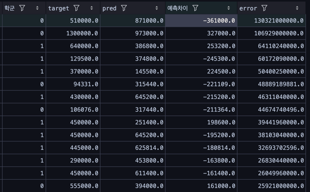

# 서울특별시 아파트 가격 모델 경진대회

## 대회 데이터셋 EDA

### 제공되는 데이터셋
- `train.csv`
- `test.csv`
    -  `train` 데이터셋에서 `target` feature만 제거된 상태

### 컬럼

기본 컬럼
```
'시군구', '번지', ...'좌표X', '좌표Y', '단지신청일', 'target'
```

### 데이터셋 크기

```
df = module.file_load.load_origin_train()
df_test = module.file_load.load_origin_test()

df.shape, df_test.shape
```
> train.csv : (1118822, 52)  
> test.csv : (9272, 51)

### 데이터 셋 EDA

```python
df_test['계약년월'].value_counts()

# 계약년월  
# 202308    3864  
# 202307    3695  
# 202309    1713  
```

테스트 데이터는 2023년 8월 ~ 9월로 분포

#### 구별 테스트 데이터 분포


모든 구 데이터가 동일하지 않지만 크게 문제되지 않는 분포로 분포되어있다.

#### 가격 데이터 분포


### 전용면적과 가격 분포

- 넓은 면적 일수록 가격이 상승하는 경향있다
- 일정 이상의 면적 데이터의 갯수가 낮은 면적에 비해 과도하게 적다


#### 구별 가격 분포

구 마다 가격 분포가 상이하다. 


#### 평수 가격분포

평수가 증가하면 가격이 상승하는 경향성을 보인다.


#### 층 과 평수 별 target 분포

10층 이하 고평수일경우 높은 가격 분포를 이루는 아파트가 존재한다


#### 층 - target 

- 고층으로 갈수록 가격이 상승하는 경향이 있으며, 이는 뷰와 프리미엄 아파트에 따른 가치 상승으로 해석될 수 있습니다.

- 낮은 층수일수록 상대적으로 낮은 중앙값을 가지지만, 
이상치가 많이 분포하는 특징을 보입니다. 
나타나는 원인을 심층 분석하기 위해 거래 시점, 위치, 면적, 특수한 입지 , 외부 요인 등을 추가로 분석할 필요가 있어보입니다.


#### 좌표 - target

좌표X, 좌표Y 결측치비율 : 77%

특정 지역에 가격이 집중되는 경향이 있으며, 이를 통해 지역별 가격 패턴을 분석할 수 있습니다. 좌표 데이터의 결측치 비율은 77%로, 이를 보완하면 분석 정확도를 높일 수 있을것으로 판단됩니다.


좌표 지점별분석으로 지역별로 아파트 가격이 다르다는것을 알 수 있다.

#### 지하철 거리 관계

지하철과의 근접성이 높은 아파트일수록 평균 가격이 높음
0~500m 거리 범위의 아파트가 가장 높은 평균 가격을 기록했습니다. 
대중교통 접근성이 아파트 가격에 긍정적인 영향을 미친다는 것을 보여줍니다.
거리가 멀어질수록 평균 가격 감소
500m이내 거리 범위는 두 번째로 높은 평균 가격을 보였으며, 
1~1.5km와 1.5~2.0km 범위로 갈수록 가격이 점차 감소하는 경향을 보였습니다.
지하철 접근성의 중요성
지하철역으로부터의 거리가 짧을수록 입지 조건이 우수하게 평가되어, 해당 지역의 아파트 수요와 가격이 상승하는 효과가 나타난 것으로 보입니다.


#### 버스정류장 거리

버스 정류장과의 거리는 대부분 큰 편차 없이 가까운 분포를 보여,
분류에 활용하기에는 적합하지 않을 것으로 보입니다.


#### 전용면적 - 분포

전용면적 데이터 분포가 매우 비대칭적입니다. 
특히  [50-100] 구간에 데이터가 집중되어있습니다.


#### 건축년도별 가격추이

오래된 아파트는 재건축 기대감으로 인해 일정 수준의 가격 상승이 발생하는것으로 예상됩니다.


### 결측치 비율

결측치가 75% 이상인 컬럼들은 외부데이터인 "아파트 단지정보" 등으로 채워우기를 시도해보았습니다.
하지만 여전히 결측치가20% 이상인 데이터들이 존재해서 중요하지 않은 피처들이라고 판단되어 제거하게하였습니다.


### 기타 결측치 

- 번지 : 221
- 본전 : 74
- 부번 : 74
- 좌표X : 858366
- 좌표Y : 858366
- 아파트명 : 2087

#### 처리 방법
- 번지와 도로명이 함께 결측치가 없으므로, 번지 결측치는 도로명으로 대체하였습니다.
- 아파트명과 도로명도 함께 결측치가 없으므로 도로명으로 대체하였습니다.
- 좌표X, 좌표Y는 EDA결과 중요한 가격 요인으로 판단되었으므로 카카오 RestAPI를 통해 보완하기로 결정했습니다.
```
  df['도로명'] = df['도로명'].replace(' ', np.nan)
  df['아파트명'] = df['아파트명'].fillna(df['도로명'])
  df['도로명'] = df['도로명'].fillna(df['아파트명'])
  df['번지'] = df['번지'].fillna(df['도로명'])
  df['본번'] = df['본번'].fillna(df['번지'])
  df['부번'] = df['부번'].fillna(df['번지'])
```


## 이상치 제거

### 급락 거래


## 외부 데이터 수집

### 좌표X, 좌표Y 채우기

아파트 단지정보 식별자

- 수집에 앞서 아파트 식별자를 통해 데이터 수를 고유하게 관리하고, 중복 데이터를 제거
- 팀원간 데이터 공유 후 맵핑시 활용

결측치 데이터 수집
- 
- 주소를 좌표로 변환 REST API 활용
- 수집 플랫폼 : kakao developers


## 파생변수

### 금리

금리 변동이 거래 가격에 미치는 영향을 시계열 데이터를 통해 분석.
6개월 및 1년 전 금리와 거래 가격 관계:
거래 가격이 금리 변화에 선행적 반응을 보이기도 하며, 경우에 따라 거래 가격 변동이 금리 변화의 지표 역할을 함.

단기 금리 변화의 효과:
금리 변화 폭이 클수록 거래 가격의 변동성이 증가하는 경향이 관찰됨.


### 기타 파생변수

- `신축 여부`, `강남 여부`

## 다중 공산성

## 모델 학습

### 베이스 코드 학습

대회에서 제공하는 기본 코드라인으로 테스트를 진행

### 모델 : 랜덤 포레스트 모델

### 로컬 Score

### 제출 Score


이상하다는것을 느꼈습니다. 로컬 Score와 제출 Score의 차이가 크다는것을 알 수 있었습니다.  
이를 해결하기 위해 다양한 방법을 시도해보았습니다.  
대회기간때는 기간에 대한 이슈같았지만, 확신이 없어서 다양한 방법을 시도해보았지만 확실한 이유를 몰랐습니다.  
대회가 끝난뒤 강사님의 대회 리뷰시간에 명확한 이유를 알 수 있었습니다.  
이유는 Train과 Valid dataset을 분할하는 과정에서 holdout 방식을 사용하였는데,  
전체기간내에서 20%의 데이터를 랜덤으로 추출하여 학습데이터와 검증데이터로 나누는 방식이었습니다.  
이는 테스트데이터가 2023년 7월~9월 데이터로 구성되어 있었기 때문에, 당연히 검증 Score가 차이가 날 수 밖에 없었습니다.  

> 퍼블릭 데이터셋과 훈련 데이터에서 최신데이터 2023-03~06월 데이터 분리하여 시도해보았습니다.



가설과 일치하는 결과를 얻을 수 있었습니다.
로컬에서 40000대 RMSE를 기록할수 있었고, 대회 요구사항에 맞는 적절한 준비 세팅이 되었습니다. 

### 1단계 결측치X,Y 좌표 채우기


### 2단계 검증 데이터셋 분리

- 검증 RMES 와 퍼블릭 데이터 RMES의 SCORE 차이가 큼
- 퍼블릭 데이터셋과 맞추어 2023-03~06월 데이터 분리

1차 훈련데이터 범위를 2019년 이후 데이터를 활용해봄
RMES가 낮아지는가?ㅇㅇ

### 3단계 LightGBM모델

- LightGBM모델

### 4단계 타임시리즈 적용

### 5단계 K-fold 활용

### 6단계 최적 하이퍼파라미터  optutun? 활용

### 7단계 target log1p 적용

### feature 라벨 인코딩


---

## shake-up 문제
https://medium.com/global-maksimum-data-information-technologies/kaggle-handbook-tips-tricks-to-survive-a-kaggle-shake-up-23675beed05e


---

## 마무리