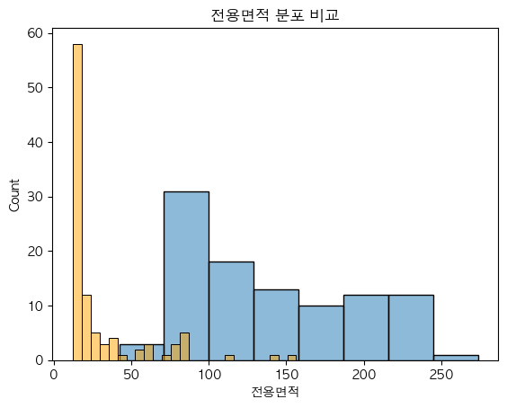

# 검증 데이터셋 , 202207 ~ 202301

## 전용면적 이상치 제거 함

>45635.4546113334

![alt text]
(image-3.png)

## 전용면적 이상치 제거 안함

> 32895.3481117613

## 한강거리 

## 강남 8학군

강남여부 의미없음

## 단지정보

### 30클러스터

달라지지않음

## optuna

RMES 상승 28000 -> 22012

  
    
  
  
  
